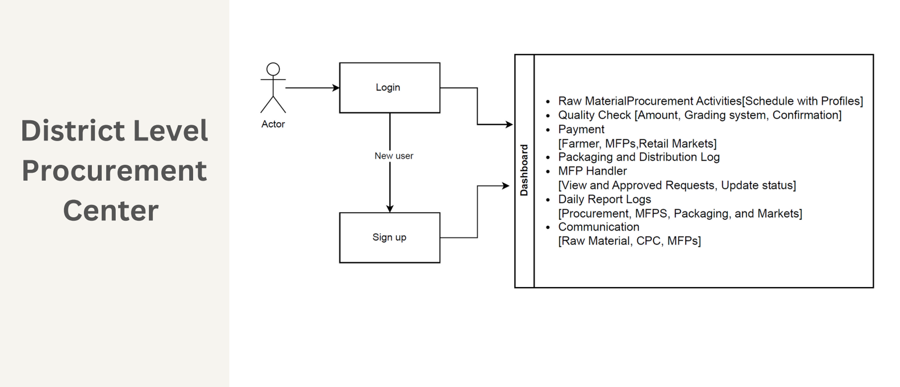
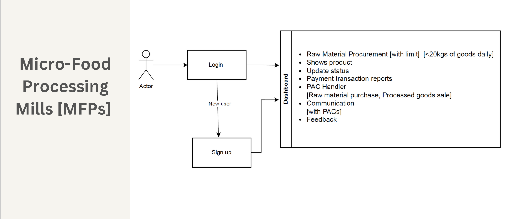
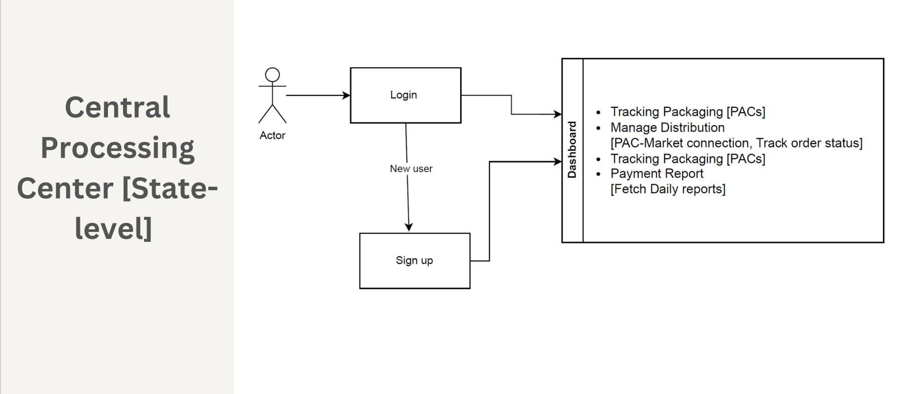
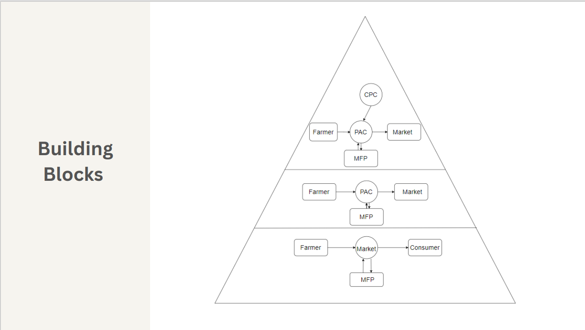
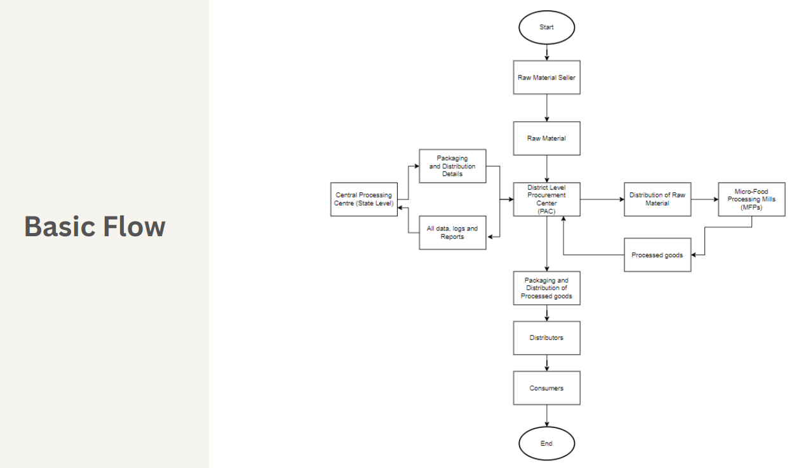
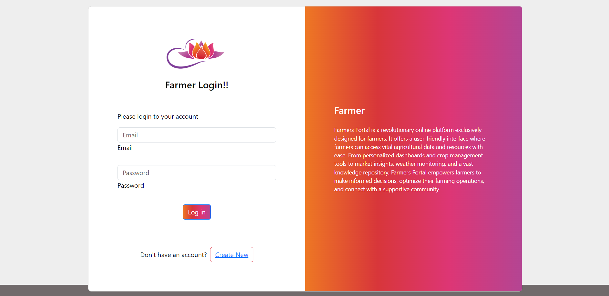
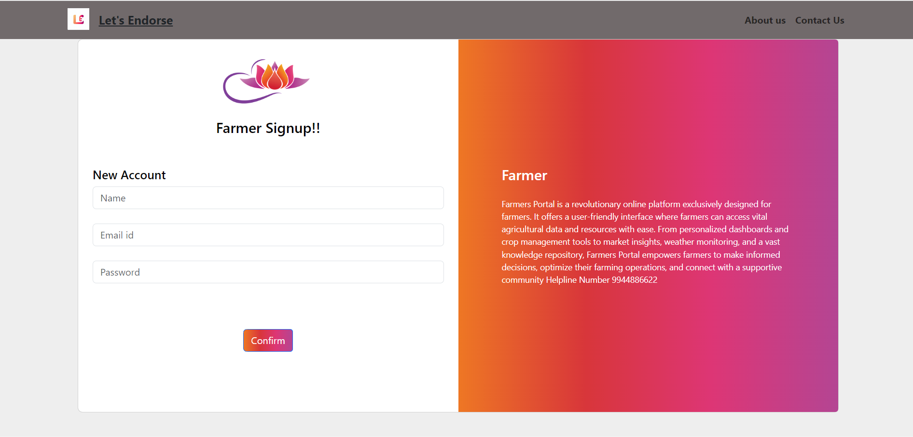
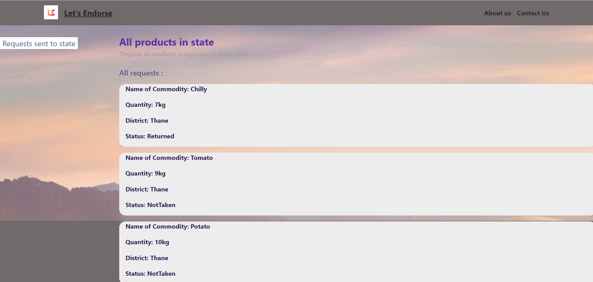
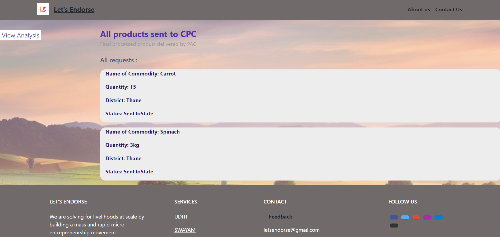

# Team-78

   <strong>AgriSync</strong>    
  

Table of Contents

- [Description](#description)
- [Links](#links)
- [Tech Stack](#tech-stack)
- [System Architecture](#system-architecture)
- [Future Scope](#future-scope)
- [Project Setup](#project-setup)
- [Usage](#usage)
- [Team Members](#team-members)
- [Mentors](#mentors)
- [Screenshots](#screenshots)

## 📝Description

1. Developed a website enabling seamless coordination and
 visibility in agricultural value chain, addressing stakeholder access to relevant information, process streamlining, tracking and status updates using React Flow
 2. Streamlined coordination between access levels including    requests, quality checks, payments, feedback and reports
3. Incorporated analytics, providing stakeholders with dashboards for data-driven decision-making using ChartJS

## 🔗Links

- [GitHub Repository](https://github.com/justaskulkarni/AgriSync-JPMC_CFG.git)
- [Demo Video](https://drive.google.com/drive/folders/1NLTDlZRaty8-WZiEGGM_bzh9SIIN-kf2)

## 🤖Tech-Stack

#### Front-end
- ReactJS

#### Back-end
- NodeJS
- ExpressJS

#### Database
- MongoDB

## ⚒️System Architecture
 

## 🔮Future Scope

## 🛠Project Setup

>Firstly, you will need to clone the repository using the clone link above using the command in terminal in a dedicated folder:

    git clone https://github.com/justaskulkarni/AgriSync-JPMC_CFG.git

>Then, you will need to install all the node modules which are required for running the client on your machine using the command in terminal for client folder:

    npm install

>Then, you will need to install all the node modules which are required for running the server on your machine using the command in terminal for server folder:

    npm install

>In the server folder create a .env file to add environment variables

    MONGO_URL = YOUR_MONGO_URL
    SECRET = YOUR_JWT_SECRET
## 💻Usage

>In terminal for client folder run
    
    npm start

>In terminal for server folder run

    npm start
## 👨‍💻Team Members

Add names of your team members with their emails and links to their GitHub accounts

- Aditya Kulkarni (Team Leader) 
- Shinjini Chatterjee
- Diya Verghese
- Nandini Kanawade
- Aaditya Vijayvargiya 

## 👨‍🏫Mentors

Add names of your mentors with their emails and links to their GitHub accounts

- Vinod Gowda 
- Shivam Nema 
- Sai Srinivas Duvvuri

## 📱Screenshots
Login and Signup

1. Farmer Level
Make Commodity Request

2. PAC Level
Ungraded Request with an option to grade them

Graded Requests at PAC

3. MFE Level
View all graded requests at PAC with an option to request a product

Processed Products at MFE with an option to return it to PAC

4. CPC Level
Track status of all requests

View all inhouse finished products 

Analytics

5. Feedback

